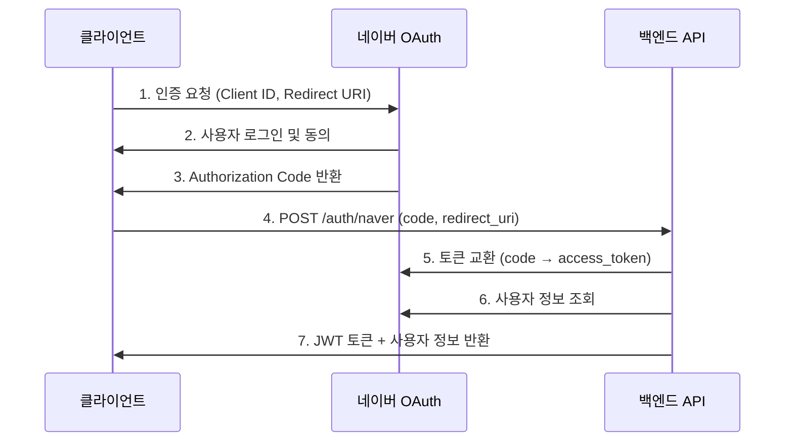

# OAuth 소셜 로그인 API 가이드

## 개요

이 문서는 카카오, 네이버, Apple 및 Google 소셜 로그인 기능의 백엔드 API 사용 가이드입니다. Apple·Google 서버 검증 계약은 각각 `_docs/APPLE_SIGN_IN_SERVER_GUIDE.md`, `_docs/GOOGLE_SIGN_IN_SERVER_GUIDE.md`를 따릅니다.

### 기본 정보

- **Base URL**: `/api/v1/auth`
- **Content-Type**: `application/json`
- **인증 방식**: OAuth 2.0 (Authorization Code / Access Token)

### 응답 형식

```typescript
// 성공 응답
{
  "success": true,
  "message": "로그인 성공" | "회원가입이 완료되었습니다.",
  "data": {
    "user": {
      "user_id": "uuid",
      "email": "user@example.com",
      "name": "사용자 이름",
      "profile_image_url": "https://...",
      "kakao_id": "카카오 ID (카카오 로그인 시)",
      "apple_id": "Apple 검증 subject (Apple 로그인 시)",
      "google_id": "Google 검증 subject (Google 로그인 시)",
      "naver_id": "네이버 ID (네이버 로그인 시)",
      "timezone": "Asia/Seoul",
      "created_at": "2026-01-11T12:00:00.000Z"
    },
    "access_token": "JWT access token",
    "refresh_token": "JWT refresh token",
    "expires_at": 1234567890000,
    "is_new_user": "Apple·Google 응답에서는 항상 boolean"
  }
}

// 실패 응답
{
  "success": false,
  "message": "에러 메시지"
}
```

---

## Apple 로그인

- `POST /api/v1/auth/apple/challenge`: 플랫폼별 일회성 state/nonce 발급
- `POST /api/v1/auth/apple/callback`: form post 응답 검증 및 앱 callback 전달
- `POST /api/v1/auth/apple`: authorization code와 identity token을 서버에서 검증하고 ShiftMate JWT 발급
- 검증 이메일이 기존 계정과 같아도 자동 연결하지 않고 `409 ACCOUNT_LINK_REQUIRED`를 반환합니다.
- 기본값은 `APPLE_AUTH_ENABLED=false`입니다.

## Google 로그인

- `POST /api/v1/auth/google/token`: Flutter가 전달한 Google ID Token을 서버에서 검증하고 ShiftMate JWT 발급
- 서버는 서명, issuer, audience, 만료 및 verified email을 검증하고 `sub`를 사용자 식별자로 저장합니다.
- 검증 이메일이 기존 계정과 같아도 자동 연결하지 않고 `409 ACCOUNT_LINK_REQUIRED`를 반환합니다.
- 기본값은 `GOOGLE_AUTH_ENABLED=false`입니다.

---

## 네이버 OAuth 로그인

### 1. 네이버 로그인 (WebView 방식 - Authorization Code)

네이버 OAuth 인증 페이지에서 받은 authorization code를 사용하여 로그인합니다.

#### 사전 준비

1. **네이버 개발자 센터** (https://developers.naver.com) 접속
2. 애플리케이션 등록 및 Client ID, Client Secret 발급
3. Callback URL 등록 (예: `http://localhost:3000/test/callback.html`)
4. 제공 정보 동의 항목 설정 (이메일, 프로필 정보 필수)

#### OAuth 인증 흐름



#### Request

```
POST /api/v1/auth/naver
```

**Headers**

```
Content-Type: application/json
```

**Body**

```json
{
  "code": "네이버에서 받은 authorization code",
  "redirect_uri": "등록된 redirect URI",
  "state": "CSRF 방지 토큰 (선택)"
}
```

| 파라미터       | 타입   | 필수 | 설명                                                          |
| -------------- | ------ | ---- | ------------------------------------------------------------- |
| `code`         | string | Y    | 네이버 OAuth 인증 후 받은 authorization code                  |
| `redirect_uri` | string | Y    | 네이버 개발자 센터에 등록된 Callback URL (정확히 일치해야 함) |
| `state`        | string | N    | CSRF 공격 방지를 위한 랜덤 문자열 (권장)                      |

#### Response

**성공 (200 OK)**

```json
{
  "success": true,
  "message": "로그인 성공",
  "data": {
    "user": {
      "user_id": "550e8400-e29b-41d4-a716-446655440000",
      "email": "user@example.com",
      "name": "홍길동",
      "profile_image_url": "https://ssl.pstatic.net/static/pwe/address/img_profile.png",
      "naver_id": "네이버_고유_ID",
      "timezone": "Asia/Seoul",
      "created_at": "2026-01-11T12:00:00.000Z"
    },
    "access_token": "eyJhbGciOiJIUzI1NiIsInR5cCI6IkpXVCJ9...",
    "refresh_token": "eyJhbGciOiJIUzI1NiIsInR5cCI6IkpXVCJ9...",
    "expires_at": 1704974400000
  }
}
```

**실패 (400 Bad Request)**

```json
{
  "success": false,
  "message": "Authorization code가 필요합니다."
}
```

```json
{
  "success": false,
  "message": "네이버 계정에 이메일 정보가 없습니다. 이메일 제공에 동의해주세요."
}
```

#### 에러 코드

| HTTP 상태 | 메시지                                       | 설명                       |
| --------- | -------------------------------------------- | -------------------------- |
| 400       | "Authorization code가 필요합니다."           | code 파라미터 누락         |
| 400       | "redirect_uri가 필요합니다."                 | redirect_uri 파라미터 누락 |
| 400       | "네이버 토큰 교환에 실패했습니다."           | 네이버 API 토큰 교환 실패  |
| 400       | "네이버 계정에 이메일 정보가 없습니다."      | 이메일 제공 동의 필요      |
| 500       | "네이버 로그인 처리 중 오류가 발생했습니다." | 서버 내부 오류             |

#### 사용 예시

**JavaScript (브라우저)**

```javascript
// 1. 네이버 OAuth 인증 페이지로 이동
const clientId = "YOUR_NAVER_CLIENT_ID";
const redirectUri = "http://localhost:3000/test/callback.html";
const state = Math.random().toString(36).substring(2, 15);

const naverAuthUrl = new URL("https://nid.naver.com/oauth2.0/authorize");
naverAuthUrl.searchParams.set("client_id", clientId);
naverAuthUrl.searchParams.set("redirect_uri", redirectUri);
naverAuthUrl.searchParams.set("response_type", "code");
naverAuthUrl.searchParams.set("state", state);

window.location.href = naverAuthUrl.toString();

// 2. Callback에서 authorization code 받기
const urlParams = new URLSearchParams(window.location.search);
const code = urlParams.get("code");
const returnedState = urlParams.get("state");

// 3. 서버 API 호출
const response = await fetch("http://localhost:3000/api/v1/auth/naver", {
  method: "POST",
  headers: {
    "Content-Type": "application/json",
  },
  body: JSON.stringify({
    code: code,
    redirect_uri: redirectUri,
    state: returnedState,
  }),
});

const data = await response.json();
if (data.success) {
  console.log("로그인 성공:", data.data.user);
  // JWT 토큰 저장
  localStorage.setItem("access_token", data.data.access_token);
  localStorage.setItem("refresh_token", data.data.refresh_token);
}
```

**cURL**

```bash
curl -X POST http://localhost:3000/api/v1/auth/naver \
  -H "Content-Type: application/json" \
  -d '{
    "code": "네이버에서_받은_authorization_code",
    "redirect_uri": "http://localhost:3000/test/callback.html",
    "state": "랜덤_문자열"
  }'
```

---

### 2. 네이버 로그인 (SDK 방식 - Access Token 직접 전송)

네이버 SDK에서 받은 access_token을 직접 전송하여 로그인합니다.

#### Request

```
POST /api/v1/auth/naver/token
```

**Headers**

```
Content-Type: application/json
```

**Body**

```json
{
  "access_token": "네이버 SDK에서 받은 access token"
}
```

| 파라미터       | 타입   | 필수 | 설명                                 |
| -------------- | ------ | ---- | ------------------------------------ |
| `access_token` | string | Y    | 네이버 SDK에서 발급받은 access token |

#### Response

**성공 (200 OK)**

```json
{
  "success": true,
  "message": "로그인 성공",
  "data": {
    "user": {
      "user_id": "550e8400-e29b-41d4-a716-446655440000",
      "email": "user@example.com",
      "name": "홍길동",
      "profile_image_url": "https://ssl.pstatic.net/static/pwe/address/img_profile.png",
      "naver_id": "네이버_고유_ID",
      "timezone": "Asia/Seoul",
      "created_at": "2026-01-11T12:00:00.000Z"
    },
    "access_token": "eyJhbGciOiJIUzI1NiIsInR5cCI6IkpXVCJ9...",
    "refresh_token": "eyJhbGciOiJIUzI1NiIsInR5cCI6IkpXVCJ9...",
    "expires_at": 1704974400000
  }
}
```

**실패 (400 Bad Request)**

```json
{
  "success": false,
  "message": "access_token이 필요합니다."
}
```

#### 사용 예시

**JavaScript (네이버 SDK)**

```javascript
// 네이버 SDK 초기화
NaverLogin.init({
  clientId: "YOUR_NAVER_CLIENT_ID",
  callbackUrl: "YOUR_CALLBACK_URL",
  isPopup: false,
  loginButton: { color: "green", type: 3, height: 58 },
});

// 로그인 버튼 클릭 시
NaverLogin.getLoginStatus(function (status) {
  if (status) {
    // 이미 로그인된 경우
    const accessToken = NaverLogin.accessToken.accessToken;
    loginWithNaverToken(accessToken);
  } else {
    // 로그인 필요
    NaverLogin.reprompt();
  }
});

// Access Token으로 서버 로그인
async function loginWithNaverToken(naverAccessToken) {
  const response = await fetch(
    "http://localhost:3000/api/v1/auth/naver/token",
    {
      method: "POST",
      headers: {
        "Content-Type": "application/json",
      },
      body: JSON.stringify({
        access_token: naverAccessToken,
      }),
    }
  );

  const data = await response.json();
  if (data.success) {
    console.log("로그인 성공:", data.data.user);
    localStorage.setItem("access_token", data.data.access_token);
    localStorage.setItem("refresh_token", data.data.refresh_token);
  }
}
```

**cURL**

```bash
curl -X POST http://localhost:3000/api/v1/auth/naver/token \
  -H "Content-Type: application/json" \
  -d '{
    "access_token": "네이버_SDK에서_받은_access_token"
  }'
```

---

## 카카오 OAuth 로그인

### 1. 카카오 로그인 (WebView 방식 - Authorization Code)

카카오 OAuth 인증 페이지에서 받은 authorization code를 사용하여 로그인합니다.

#### Request

```
POST /api/v1/auth/kakao
```

**Headers**

```
Content-Type: application/json
```

**Body**

```json
{
  "code": "카카오에서 받은 authorization code",
  "redirect_uri": "등록된 redirect URI"
}
```

| 파라미터       | 타입   | 필수 | 설명                                         |
| -------------- | ------ | ---- | -------------------------------------------- |
| `code`         | string | Y    | 카카오 OAuth 인증 후 받은 authorization code |
| `redirect_uri` | string | Y    | 카카오 개발자 콘솔에 등록된 Redirect URI     |

#### Response

**성공 (200 OK)**

```json
{
  "success": true,
  "message": "로그인 성공",
  "data": {
    "user": {
      "user_id": "550e8400-e29b-41d4-a716-446655440000",
      "email": "user@example.com",
      "name": "홍길동",
      "profile_image_url": "https://...",
      "kakao_id": "카카오_고유_ID",
      "timezone": "Asia/Seoul",
      "created_at": "2026-01-11T12:00:00.000Z"
    },
    "access_token": "eyJhbGciOiJIUzI1NiIsInR5cCI6IkpXVCJ9...",
    "refresh_token": "eyJhbGciOiJIUzI1NiIsInR5cCI6IkpXVCJ9...",
    "expires_at": 1704974400000
  }
}
```

---

### 2. 카카오 로그인 (SDK 방식 - Access Token 직접 전송)

카카오 SDK에서 받은 access_token을 직접 전송하여 로그인합니다.

#### Request

```
POST /api/v1/auth/kakao/token
```

**Headers**

```
Content-Type: application/json
```

**Body**

```json
{
  "access_token": "카카오 SDK에서 받은 access token"
}
```

| 파라미터       | 타입   | 필수 | 설명                                 |
| -------------- | ------ | ---- | ------------------------------------ |
| `access_token` | string | Y    | 카카오 SDK에서 발급받은 access token |

#### Response

**성공 (200 OK)**

```json
{
  "success": true,
  "message": "로그인 성공",
  "data": {
    "user": {
      "user_id": "550e8400-e29b-41d4-a716-446655440000",
      "email": "user@example.com",
      "name": "홍길동",
      "profile_image_url": "https://...",
      "kakao_id": "카카오_고유_ID",
      "timezone": "Asia/Seoul",
      "created_at": "2026-01-11T12:00:00.000Z"
}
```

---

## 공통 기능

### 사용자 계정 연결

같은 이메일로 다른 OAuth 제공자(카카오/네이버)로 로그인한 경우, 기존 계정에 자동으로 연결됩니다.

**예시 시나리오**:

1. 사용자가 카카오로 회원가입 (email: `user@example.com`)
2. 동일한 이메일로 네이버 로그인 시도
3. 서버가 기존 계정을 찾아 네이버 ID를 연결
4. 이후 카카오 또는 네이버로 모두 로그인 가능

### 신규 사용자 처리

- 신규 사용자 자동 회원가입
- 기본 근무 템플릿 자동 생성
- 기본 타임존: `Asia/Seoul`

### JWT 토큰 관리

로그인 성공 시 발급되는 토큰:

- **Access Token**: 7일 만료, API 인증에 사용
- **Refresh Token**: 30일 만료, 토큰 갱신에 사용 (DB에 해시값 저장)

**토큰 사용 방법**:

```
Authorization: Bearer {access_token}
```

**토큰 갱신**:

```
POST /api/v1/auth/refresh
Content-Type: application/json

{
  "refresh_token": "refresh_token_값"
}
```

---

## 테스트 페이지

개발 환경에서 테스트할 수 있는 HTML 페이지가 제공됩니다:

- **네이버 로그인**: `http://localhost:3000/test/naver-login.html`
- **카카오 로그인**: `http://localhost:3000/test/kakao-login.html`
- **공통 Callback**: `http://localhost:3000/test/callback.html`

### 테스트 페이지 사용 방법

1. 서버 실행 (`npm run dev`)
2. 브라우저에서 테스트 페이지 접속
3. OAuth Client ID 및 Redirect URI 입력
4. 로그인 버튼 클릭
5. OAuth 제공자(네이버/카카오) 로그인 및 동의
6. 자동으로 서버 API 호출 및 결과 표시

---

## 환경변수 설정

서버 측 환경변수 설정이 필요합니다:

```env
# 네이버 OAuth
NAVER_CLIENT_ID=your-naver-client-id
NAVER_CLIENT_SECRET=your-naver-client-secret

# 카카오 OAuth
KAKAO_CLIENT_ID=your-kakao-client-id
KAKAO_CLIENT_SECRET=your-kakao-client-secret
```

---

## 주의사항

### 네이버 OAuth

1. **Redirect URI 일치**: 네이버 개발자 센터에 등록된 Callback URL과 요청 시 전송하는 `redirect_uri`가 정확히 일치해야 합니다.
2. **이메일 필수**: 네이버 API에서 이메일 정보 제공 동의가 필요합니다. 이메일이 없으면 로그인 실패합니다.
3. **State 파라미터**: CSRF 공격 방지를 위해 `state` 파라미터 사용을 권장합니다.
4. **Client Secret**: 서버에서만 사용하고 클라이언트에 노출하지 마세요.

### 카카오 OAuth

1. **Redirect URI 일치**: 카카오 개발자 콘솔에 등록된 Redirect URI와 요청 시 전송하는 `redirect_uri`가 정확히 일치해야 합니다.
2. **Scope 설정**: 필요한 사용자 정보에 대한 scope를 요청해야 합니다 (예: `profile_nickname`, `account_email`).

### 공통

1. **HTTPS 권장**: 프로덕션 환경에서는 반드시 HTTPS를 사용하세요.
2. **토큰 보안**: Access Token과 Refresh Token을 안전하게 저장하세요 (httpOnly 쿠키 권장).
3. **에러 처리**: 모든 API 호출에 대한 적절한 에러 처리를 구현하세요.

---

## FAQ

### Q: 네이버 로그인 시 "이메일 정보가 없습니다" 오류가 발생합니다.

A: 네이버 개발자 센터에서 애플리케이션 설정의 "제공 정보"에서 이메일 제공 동의를 활성화해야 합니다.

### Q: Redirect URI가 일치하지 않는다는 오류가 발생합니다.

A: 네이버/카카오 개발자 센터에 등록된 Callback URL과 API 요청 시 전송하는 `redirect_uri` 값이 정확히 일치해야 합니다. 대소문자, 슬래시, 쿼리 파라미터까지 모두 일치해야 합니다.

### Q: 같은 이메일로 여러 OAuth 제공자를 사용할 수 있나요?

A: 네, 가능합니다. 같은 이메일로 다른 OAuth 제공자(카카오/네이버)로 로그인하면 기존 계정에 자동으로 연결됩니다.

### Q: Access Token은 어디에 저장해야 하나요?

A: 보안을 위해 httpOnly 쿠키에 저장하는 것을 권장합니다. localStorage나 sessionStorage는 XSS 공격에 취약합니다.

### Q: Refresh Token은 어떻게 사용하나요?

A: Access Token이 만료되면 Refresh Token을 사용하여 새로운 Access Token을 발급받을 수 있습니다. `POST /api/v1/auth/refresh` 엔드포인트를 사용하세요.

---

## 참고 자료

- [네이버 개발자 센터](https://developers.naver.com)
- [카카오 개발자 콘솔](https://developers.kakao.com)
- [OAuth 2.0 공식 문서](https://oauth.net/2/)

---

**문서 버전**: 1.0  
**최종 업데이트**: 2026-01-11
